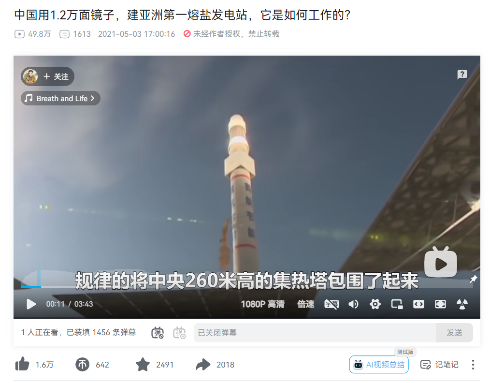

[中国用1.2万面镜子,建亚洲第一熔盐发电站,它是如何工作的?](https://www.bilibili.com/video/BV1kU4y1b762)

<iframe
    src="//player.bilibili.com/player.html?aid=672753068&bvid=BV1kU4y1b762&cid=331326497&p=1"
    scrolling="no"
    border="0"
    frameborder="no"
    framespacing="0"
    allowfullscreen="true"
    width="600px"
    height="500px" >
</iframe>

[1-2 太空城?中国用42万块镜子构筑世界奇迹](https://www.bilibili.com/bangumi/play/ep391330)



[速学python 程序设计从入门到实践](https://weread.qq.com/web/reader/e2532af0813ab8022g018f02)

```py3
# NOTE 32_经典的cpython的英文关键字版本

长度 = 10
宽度 = 12
面积 = 长度 * 宽度
print("每个镜子的面积_经典的cpython的英文关键字版本:")
print(面积)
```

```py3
# NOTE 34_中文版本

长度 = 10
宽度 = 12
面积 = 长度 * 宽度
打印("每个镜子的面积_中文版本:")
打印(面积)
```
